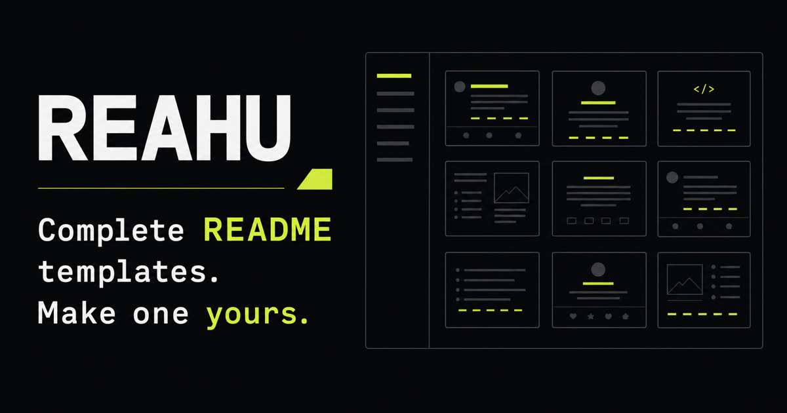
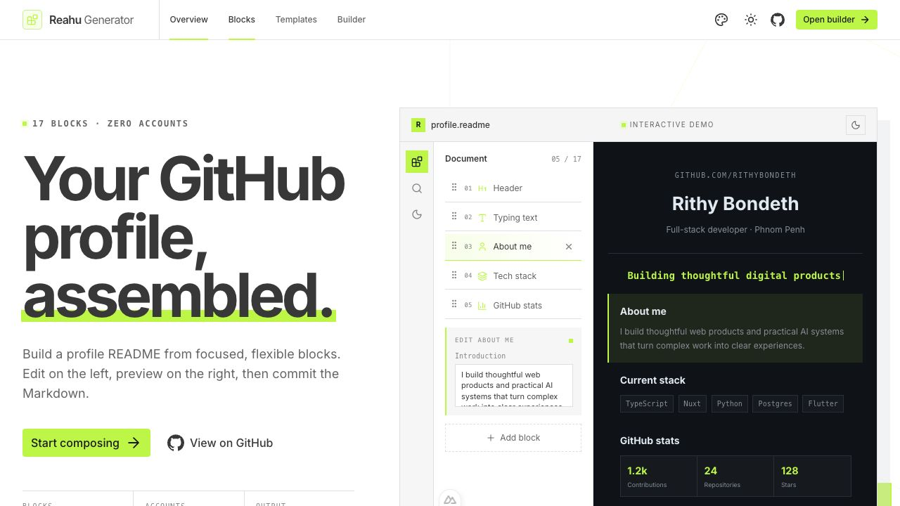
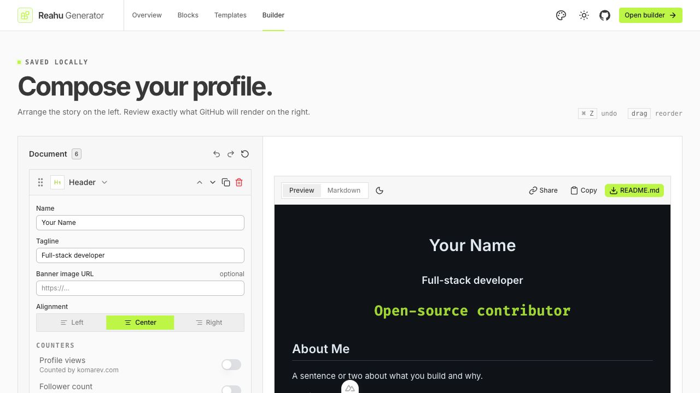

<div align="center">



# Reahu Generator

**Build a GitHub profile that feels like you — without hand-writing the Markdown.**

Compose your profile from focused blocks, preview it exactly as GitHub will render it, and export a ready-to-use `README.md`.

[](https://reahu-generator.vercel.app)
[](https://reahu-generator.vercel.app/build)
[](https://github.com/RithyBondeth/Nuxt-Reahu-Generator/stargazers)

**Trusted by 1,000+ developers building standout GitHub profiles.**

[](https://nuxt.com)
[](https://vuejs.org)
[](https://www.typescriptlang.org)
[](./LICENSE)

</div>

## See it in action



<p align="center">
  <a href="https://reahu-generator.vercel.app"><strong>Explore the live app →</strong></a>
</p>

## Why Reahu?

Great profile READMEs are memorable, but building one often means copying snippets, fixing broken image URLs, and repeatedly checking GitHub to see how everything renders.

Reahu turns that work into a visual workflow:

1. Pick a template or start with a useful default.
2. Add and arrange the blocks that tell your story.
3. Edit on the left while the GitHub-style preview updates on the right.
4. Copy, share, or download the finished Markdown.

Everything runs in your browser. There is no account, database, or backend, and your draft stays on your device.

## Highlights

| | Feature | What it gives you |
| --- | --- | --- |
| 🧩 | **17 focused blocks** | Headers, tech stacks, stats, activity, projects, socials, sponsors, and more |
| 🎨 | **12 complete templates** | Strong starting points for different developer profiles and specialties |
| 👀 | **Live GitHub-style preview** | Review your README in both light and dark themes before publishing |
| ↕️ | **Drag-and-drop composition** | Reorder, duplicate, edit, or remove any section |
| ↩️ | **Undo, redo, and autosave** | Experiment freely without losing your work |
| 🔗 | **Shareable links** | Encode the document in the URL—no server-side storage required |
| 📄 | **Markdown export** | Copy the source or download a ready-to-commit `README.md` |
| 🔒 | **Private by default** | No sign-up, tracking account, database, or cloud draft storage |

### A block library made for developer profiles

- Animated banners and typing text
- About, quote, table, divider, and custom Markdown sections
- Tech stacks with roughly 200 icons
- GitHub stats, streaks, languages, activity graphs, trophies, and pinned repositories
- Custom badges and links for 50 social platforms
- GitHub Sponsors, Buy Me a Coffee, Ko-fi, and other support buttons
- Around 70 themes for compatible GitHub cards
- Contribution snake and other motion-focused elements

## The builder



The builder keeps the document controls and rendered result side by side. Every block has sensible defaults, purpose-built controls, and a pure Markdown renderer behind it.

## Templates

Start quickly with one of 12 profiles, then make every part your own:

| General | Specialist | Creator |
| --- | --- | --- |
| Quiet Craft | Backend Blueprint | Creative System |
| Full-stack Signal | Mobile Momentum | Freelance Studio |
| Learning in Public | Cloud Control Room | Indie Launch |
| Open-source Pulse | Data Field Notes | Research Ledger |

[Browse all templates →](https://reahu-generator.vercel.app/templates)

## Quick start

### Requirements

- Node.js 20 or newer
- npm

### Run locally

```bash
git clone https://github.com/RithyBondeth/Nuxt-Reahu-Generator.git
cd Nuxt-Reahu-Generator
npm install
npm run dev
```

Open [http://localhost:3000](http://localhost:3000). The builder is available at [http://localhost:3000/build](http://localhost:3000/build).

## Available commands

| Command | Description |
| --- | --- |
| `npm run dev` | Start the local development server |
| `npm run build` | Create a production build in `.output/` |
| `npm run preview` | Preview the production build locally |
| `npm run lint` | Check the codebase with ESLint |
| `npm run typecheck` | Run Nuxt and Vue TypeScript checks |
| `npm test` | Run the document and renderer regression tests |
| `npm run test:watch` | Run regression tests in watch mode |

## How it works

A Reahu document is an ordered array of typed blocks. The app turns that array into Markdown through a small, framework-independent render pipeline.

```text
pages
  ↓
components
  ↓
composables
  ↓
core renderers
  ↓
configuration + types
```

```text
app/
├── components/
│   ├── blocks/       Block list, cards, editors, and history controls
│   ├── landing/      Product demonstration and marketing sections
│   └── readme/       Preview, toolbar, and output panel
├── composables/      Document state, persistence, undo, and redo
├── config/           Icons, services, themes, platforms, and UI options
├── core/
│   ├── blocks/       Definitions, defaults, and block factories
│   ├── document/     Local storage, sharing, and download helpers
│   ├── render/       Pure block-to-Markdown renderers
│   └── templates/    Ready-made profile documents
├── pages/            Landing page, templates, and builder
└── types/            Shared TypeScript contracts
```

The dependency direction stays simple: the core renderers and configuration do not import Vue, so the Markdown pipeline can be tested independently of the interface.

### Add a new block

The type system guides the implementation:

1. Add the props to `app/types/block.ts`.
2. Create and register a renderer in `app/core/render/`.
3. Add its label, category, icon, and defaults in `app/core/blocks/definitions.ts`.
4. Build the matching editor in `app/components/blocks/editors/`.

The project will fail type-checking if a block is missing from the renderer registry or block palette.

## Deployment

Reahu works on Vercel, Netlify, Cloudflare Pages, and other Nuxt-compatible hosts.

```bash
npm run build
```

Deploy the generated `.output/` directory. The public pages and template gallery are prerendered for discoverability, while `/build` stays client-side because it reads local drafts and shared documents from the browser.

## Privacy and external services

Reahu does not send drafts to its own backend. Local drafts use `localStorage`, and shared documents are compressed into the URL fragment.

Some generated blocks load public images from third-party services such as Shields.io, Skill Icons, GitHub Readme Stats, GitHub Profile Trophy, Streak Stats, Capsule Render, and the GitHub Readme Activity Graph. Those services have their own availability and privacy policies. Their hosts are centralized in `app/config/services.ts` so maintainers can replace or self-host them easily.

## Contributing

Contributions are welcome. A helpful way to get started:

1. Fork the repository and create a focused branch.
2. Make the change and keep block props JSON-serializable.
3. Run `npm run lint`, `npm run typecheck`, and `npm run build`.
4. Open a pull request explaining the problem and the result.

Bug reports, template ideas, accessibility improvements, new block proposals, and documentation fixes are all valuable.

## Support the project

If Reahu helps you build a better GitHub profile, please consider [giving the repository a star](https://github.com/RithyBondeth/Nuxt-Reahu-Generator). It helps more developers discover the project and gives the work momentum.

You can also:

- Share Reahu with a friend or community.
- Open an issue with a useful idea.
- Contribute a fix, template, or new block.
- Follow [Rithy Bondeth](https://github.com/RithyBondeth) for future releases.

## Author

Designed and developed by **[Rithy Bondeth](https://github.com/RithyBondeth)** — full-stack developer and AI engineer in Phnom Penh, Cambodia.

[Portfolio](https://bondeth.dev) · [GitHub](https://github.com/RithyBondeth) · [Live project](https://reahu-generator.vercel.app)

## License

Released under the [MIT License](./LICENSE).

<div align="center">

**Your GitHub profile is part of your portfolio. Make it memorable.**

[Build yours now →](https://reahu-generator.vercel.app/build)

</div>
